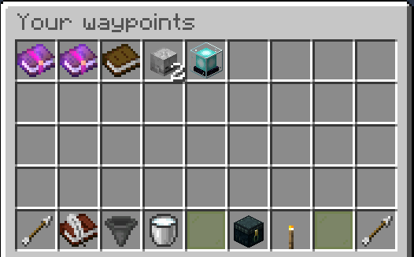
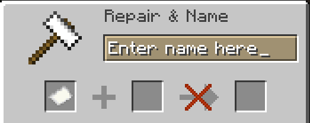
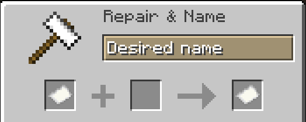
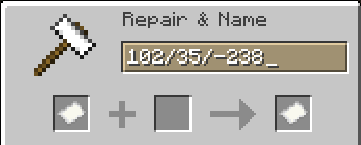

## Creating waypoints

To create a new waypoint **at your current location** you must click on the torch in the main overview or in the overview of the folder you want the waypoint to
be in:

Once you have clicked the torch an anvil input appears, and you can enter your desired name.

_Note: Depending on configuration, duplicate names are not allowed_

When you finished entering the name, click on the item in the result slot to create the waypoint

And when done, the [Waypoint will open in the GUI](waypoint).

### Creating a waypoint at an arbitrary location

To create a waypoint at arbitrary coordinates in your current world, **shift-click** the torch instead to open this anvil input.

Now enter the coordinates in the format of `X/Y/Z` like this.

After that the creation proceeds as normal with the name of the waypoint.