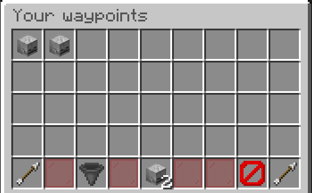
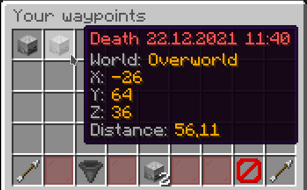
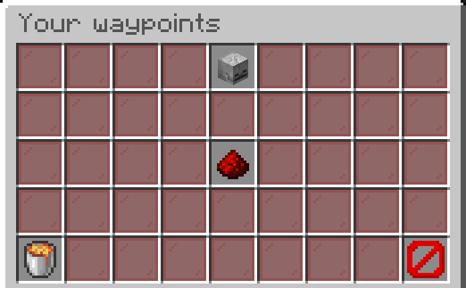

## Death Folder

When you open the death folder you will see a screen like this:

In the folder are all the locations you have died at (that you have not deleted).

You can distinguish your deaths by the date and time in their name.

The waypoints can only be selected or deleted.

