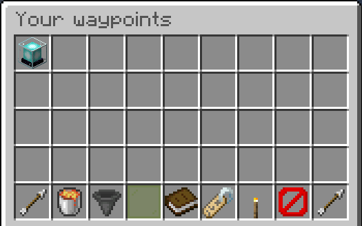

## Folders

When you have a folder open you will see something like this:

At the top you have the waypoints that are in the folder.

With the lava bucket you can delete the folder. The waypoints in this folder are moved back into the overview.

The book is the icon of the folder. If you click it you can set the icon to the item in your main hand.

With the name tag you can rename the folder.

The torch creates a waypoint in this folder.