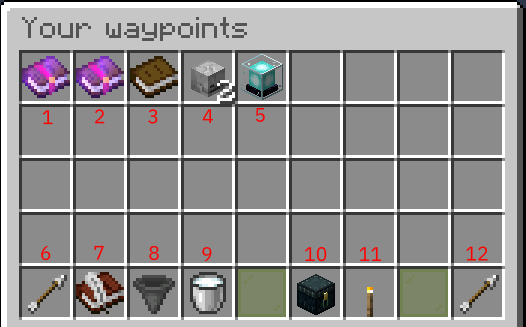

## Documentation for players

There are some [commands](commands) available to use this plugin, but the main functionality is only available through the GUI.

### Opening the GUI

You can either use the command `/waypoints` or hold a compass in your hand, sneak and right-click.

Now you should see something similar to this:

1. Restricted waypoints: In this folder are waypoints that require a permission to access [^1]
2. Public waypoints: In this folder are waypoints that are available to everyone on the server [^2]
3. [Custom folder](folder): This is a folder created by you
4. [Death folder](deathfolder): In here are the locations you have died [^3]
5. Waypoint: This is a waypoint you have created
6. Previous page: If the 4 rows would be filled completely, you can change the page
7. [Create a custom folder](createfolder)
8. Sorting: Hover your mouse over the item and see the possible sorting options
9. Deselect waypoint: If you no longer wish to get the direction shown
10. Toggle the visibility of global waypoints (public and permission)
11. [Create a new waypoint](createwaypoint)
12. Next page: If the 4 rows would be filled completely, you can change the page

By default, the barrier item takes you to the previous page you have looked at.

[^1]: Only visible if you have the permission for one of the waypoints and global visibility toggled on
[^2]: Only visible if there are public waypoints and global visibility toggled on
[^3]: Only visible if you have died before and did not delete the waypoints in it