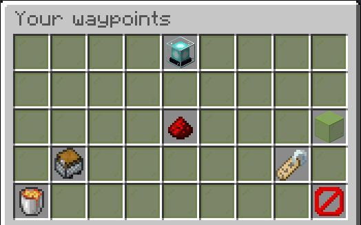
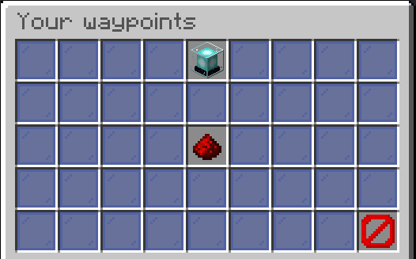
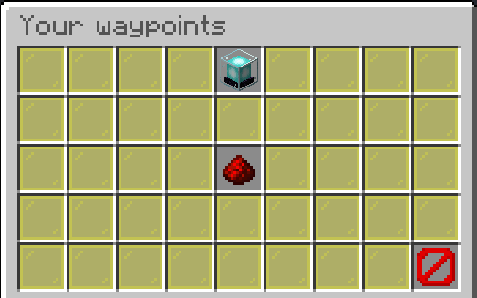

## Waypoints

### Private waypoint

When you open a private waypoint you will see an inventory like this:

The beacon is the icon of the waypoint. If you click it you can set the icon to the item in your main hand.

The redstone selects the waypoint. Now the plugin will guide you to it.

The colored glass block allows you to change the color of the beacon when near enough to the waypoint.

The chest minecraft opens a menu where you can select the folder for the waypoint.

The name tag changes the name of waypoint.

The lava bucket deletes the waypoint.

### Global waypoints

Public...

...and restricted waypoints can only be selected:

